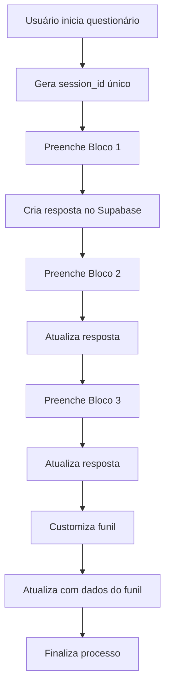

# 🔌 Integração com Supabase

Este documento descreve a integração do **Supabase** no projeto **gamified-crm-app** para armazenamento de dados de resposta do questionário.

## 📋 Visão Geral

O projeto agora está conectado ao Supabase para persistir todas as respostas do questionário gamificado em tempo real. Os dados são salvos progressivamente conforme o usuário avança pelos blocos do questionário.

## 🗄️ Estrutura do Banco de Dados

### Tabela: `user_responses`

A tabela `user_responses` já existe no projeto Supabase **"Mapeamento CRM Respostas"** e contém os seguintes campos:

| Campo | Tipo | Descrição |
|-------|------|-----------|
| `id` | uuid | Identificador único da resposta (PK) |
| `created_at` | timestamptz | Data/hora de criação |
| `updated_at` | timestamptz | Data/hora da última atualização |
| `session_id` | text | ID único da sessão do usuário |
| **Bloco 1 - Informações do Negócio** |
| `city` | text | Cidade/região de atuação |
| `website` | text | URL do website |
| `offer` | text | Oferta principal |
| `avg_price` | text | Ticket médio |
| `has_price_table` | boolean | Possui tabela de preços |
| `volume` | text | Volume de atendimentos |
| **Bloco 2 - Público & Operações** |
| `objections` | text | Principais objeções do público |
| `flow` | text | Processo de atendimento |
| `hours` | text | Horários de funcionamento |
| `payment_methods` | text[] | Formas de pagamento |
| `system` | text | Sistema de gestão utilizado |
| `key_message` | text | Mensagem-chave da marca |
| **Bloco 3 - IA & Expectativas** |
| `ai_capabilities` | text[] | Funções da IA |
| `ai_restrictions` | text | Limitações da IA |
| `tone` | text | Tom de voz desejado |
| `main_function` | text | Função principal |
| `manual_tasks` | text | Tarefas a automatizar |
| **Funil Personalizado** |
| `funnel_columns` | jsonb | Configuração do funil CRM |

## 🔧 Arquivos Criados/Modificados

### Novos Arquivos

1. **`server/supabase.ts`**
   - Cliente Supabase para o servidor
   - Funções CRUD para gerenciar respostas:
     - `createUserResponse()` - Criar nova resposta
     - `updateUserResponse()` - Atualizar resposta existente
     - `getUserResponseBySessionId()` - Buscar por session_id
     - `getAllUserResponses()` - Listar todas as respostas

2. **`client/src/lib/supabase.ts`**
   - Cliente Supabase para o frontend
   - Configuração com variáveis de ambiente do Vite

3. **`.env.local`**
   - Variáveis de ambiente para desenvolvimento
   - Contém credenciais do Supabase

4. **`.env.example`**
   - Template de variáveis de ambiente
   - Atualizado com configurações do Supabase

### Arquivos Modificados

1. **`server/routers.ts`**
   - Adicionado router `responses` com endpoints tRPC:
     - `responses.create` - Criar resposta
     - `responses.update` - Atualizar resposta
     - `responses.getBySessionId` - Buscar por sessão
     - `responses.getAll` - Listar todas

2. **`client/src/pages/Home.tsx`**
   - Integração completa com tRPC
   - Geração de `session_id` único usando `nanoid`
   - Salvamento progressivo dos dados:
     - **Block 1**: Cria nova resposta
     - **Block 2**: Atualiza com dados de público/operações
     - **Block 3**: Atualiza com dados de IA
     - **Custom Funnel**: Atualiza com configuração do funil

3. **`client/src/pages/CustomFunnel.tsx`**
   - Modificado para passar dados do funil ao finalizar
   - Dados são salvos em formato JSON no campo `funnel_columns`

4. **`package.json`**
   - Adicionada dependência `@supabase/supabase-js@2.85.0`

## 🚀 Como Usar

### 1. Configuração Inicial

As variáveis de ambiente já estão configuradas em `.env.local`:

```bash
SUPABASE_URL=https://hbwezpzgbllncuooccoc.supabase.co
SUPABASE_ANON_KEY=eyJhbGciOiJIUzI1NiIsInR5cCI6IkpXVCJ9...
VITE_SUPABASE_URL=https://hbwezpzgbllncuooccoc.supabase.co
VITE_SUPABASE_ANON_KEY=eyJhbGciOiJIUzI1NiIsInR5cCI6IkpXVCJ9...
```

### 2. Instalação

```bash
# As dependências já foram instaladas
pnpm install
```

### 3. Executar o Projeto

```bash
# Modo desenvolvimento
pnpm dev

# Build para produção
pnpm build
pnpm start
```

### 4. Testar a Integração

1. Acesse o questionário
2. Preencha os dados do **Bloco 1** e avance
3. Continue com **Bloco 2** e **Bloco 3**
4. Customize o funil no **Custom Funnel**
5. Finalize o processo

Os dados serão salvos automaticamente no Supabase a cada etapa.

## 📊 Fluxo de Dados



## 🔍 Consultar Dados

### Via tRPC (Frontend)

```typescript
// Buscar resposta por session_id
const { data } = trpc.responses.getBySessionId.useQuery({ 
  session_id: "abc123" 
});

// Listar todas as respostas
const { data } = trpc.responses.getAll.useQuery();
```

### Via Supabase (Backend)

```typescript
import { supabase } from './server/supabase';

// Buscar todas as respostas
const responses = await getAllUserResponses();

// Buscar por session_id
const response = await getUserResponseBySessionId('abc123');
```

### Via Supabase Dashboard

Acesse o [Supabase Dashboard](https://supabase.com/dashboard/project/hbwezpzgbllncuooccoc/editor) para visualizar e gerenciar os dados diretamente.

## 🔐 Segurança

- As chaves de API estão configuradas como **anon key** (pública)
- Para produção, considere implementar **Row Level Security (RLS)** no Supabase
- Nunca exponha a **service_role key** no frontend

## 📝 Próximos Passos

1. **Implementar RLS (Row Level Security)**
   - Definir políticas de acesso aos dados
   - Proteger dados sensíveis

2. **Adicionar autenticação**
   - Vincular respostas a usuários autenticados
   - Permitir que usuários vejam apenas suas respostas

3. **Dashboard de análise**
   - Criar página para visualizar respostas coletadas
   - Gráficos e estatísticas dos dados

4. **Exportação de dados**
   - Permitir exportar respostas em CSV/Excel
   - Gerar relatórios personalizados

## 🆘 Troubleshooting

### Erro de conexão com Supabase

Verifique se as variáveis de ambiente estão corretas:
```bash
echo $SUPABASE_URL
echo $VITE_SUPABASE_URL
```

### Dados não estão sendo salvos

1. Verifique o console do navegador para erros
2. Confirme que o projeto Supabase está ativo
3. Verifique se a tabela `user_responses` existe

### Erro de TypeScript

Execute a verificação de tipos:
```bash
pnpm check
```

## 📚 Recursos

- [Documentação do Supabase](https://supabase.com/docs)
- [Supabase JavaScript Client](https://supabase.com/docs/reference/javascript/introduction)
- [tRPC Documentation](https://trpc.io/docs)

---

**Projeto**: gamified-crm-app  
**Supabase Project**: Mapeamento CRM Respostas  
**Project ID**: hbwezpzgbllncuooccoc  
**Region**: us-east-1
